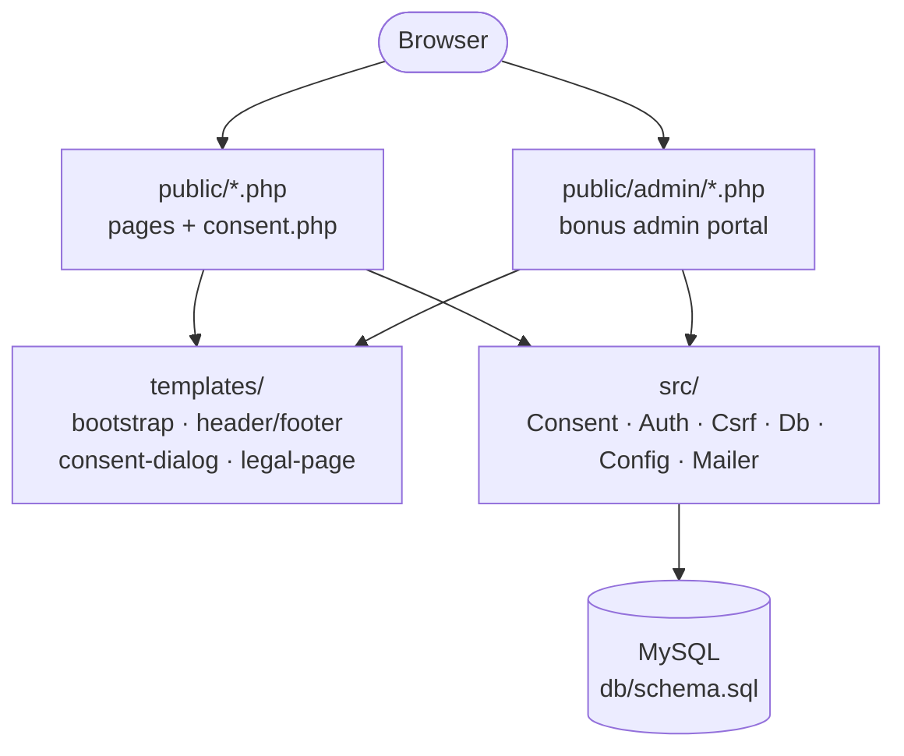

# Star Media Group — 4-Page Consent Site

A practical-test build in PHP 8.2+ and MySQL 8, no framework, no build step. Four public
pages (Home, About/Contact, Privacy Policy, Terms & Conditions) with a blocking first-visit
cookie-consent gate recorded to both a cookie and the database, plus a secured admin portal
for reviewing consent acceptances.

## Table of contents
- [What's implemented](#whats-implemented)
- [Live deployment](#live-deployment)
- [Prerequisites](#prerequisites)
- [Local setup](#local-setup)
- [Run with Docker](#run-with-docker)
- [Create an admin user](#create-an-admin-user)
- [Local email testing](#local-email-testing)
- [Codebase structure](#codebase-structure)
- [Running the tests](#running-the-tests)
- [Design decisions](#design-decisions)
- [Further reading](#further-reading)

## What's implemented

- **4 public pages** — Home, About/Contact (with a working contact form), Privacy Policy and
  Terms & Conditions (one shared template)
- **Consent gate** — blocking on first visit, works with JavaScript fully disabled (real form
  POST + redirect), scroll-locked server-side with no flash, reappears on cookie expiry or a
  bumped notice version. Privacy Policy and Terms & Conditions are never blocked — visitors read
  them first and choose from a sticky consent bar. Accept fails closed if the database is down.
- **Contact form** — server-side validated, sends via PHP's native `mail()`, persisted to the
  database regardless of delivery outcome
- **Admin portal** (bonus) — authenticated dashboard with stat cards, a searchable/paginated
  consent table, and a filterable CSV export
- Responsive at 375 / 768 / 1440px throughout

## Live deployment
Deployed on [Railway](https://railway.app) from this repo's `Dockerfile` — see
`docs/DEPLOYMENT.md` for the full runbook.

- **URL:** https://star-media-practical-test-production.up.railway.app
- **Admin login:** `/admin/login.php` — username `admin`, password `DA78E*L1-mGjyZbGsxME`

Verified end-to-end against the live deployment: all 4 public pages, the consent gate (accept/
decline cookies, `consent_log` row, `Secure` flag via Railway's `X-Forwarded-Proto` edge header),
admin login (including rejecting a wrong password and the CSRF-invalid case on `consent.php`),
every admin subpage (dashboard, audit log, CSV export, change password), logout clearing the
session, and the contact form persisting to `contact_messages`.

## Prerequisites
- PHP 8.2+ with the `pdo_mysql` extension
- MySQL 8

## Local setup
```bash
git clone https://github.com/marwanbukhori/star-media-practical-test.git
cd star-media-practical-test

# 1. Database
mysql -u root -p < db/schema.sql

# 2. Config
cp config.example.php config.php
# edit config.php with your DB credentials

# 3. Run
php -S localhost:8000 -t public
```
Visit `http://localhost:8000`.

## Run with Docker
No local PHP or MySQL install needed — one command builds the app image (`php:8.2-apache`)
and a MySQL 8 container, importing `db/schema.sql` automatically on first run:
```bash
docker compose up -d --build
```
Visit `http://localhost:8000`. `config.php` is never read in this path — the app gets its DB
credentials from environment variables set in `docker-compose.yml` (see `src/Config.php`; this
is the same mechanism Railway uses in production, see `docs/DEPLOYMENT.md`).

## Create an admin user
```bash
php bin/seed-admin.php
# or, running under Docker:
docker compose exec app php bin/seed-admin.php
```
Prompts for a username and password (min. 8 characters) and inserts the bcrypt hash into
`admin_users`. Then sign in at `http://localhost:8000/admin/login.php`.

## Local email testing
The contact form sends via PHP's native `mail()` — no Composer dependency. To capture outgoing
mail locally without a real SMTP server, point `sendmail_path` in `php.ini` (or via
`php -S -d sendmail_path=...`) at a local capture tool such as
[Mailpit](https://github.com/axllent/mailpit) or MailHog. Every submission is also persisted to
the `contact_messages` table regardless of whether delivery succeeds, so nothing is lost if
mail isn't configured.

## Codebase structure

Every request follows the same shape: a `public/` entry point pulls in `templates/` for shared
markup and `src/` for logic and data access, which is the only layer that talks to MySQL.



| Path | What's there | Why it matters |
|---|---|---|
| `public/` | `index.php` `about.php` `privacy.php` `terms.php` `consent.php` | The four graded pages, plus the single POST endpoint the consent dialog's form submits to (`action=accept`/`decline`) — it validates CSRF/shape then hands off to `Consent::accept()`/`decline()`. `privacy.php`/`terms.php` share one `templates/legal-page.php`. |
| `public/admin/` | `login.php` `index.php` `record.php` `export.php` `audit.php` `change-password.php` `logout.php` | The bonus admin portal, gated by `src/Auth.php`. `index.php` is the dashboard (stat cards + searchable/paginated table); `export.php` is a filtered CSV. |
| `public/assets/` | `css/tokens.css` `site.css` `home.css`, `js/consent.js` | `tokens.css` is copied verbatim from the design handoff, never edited. `consent.js` is the *only* JS file in the app — strictly progressive enhancement; every flow already works as a plain form POST with JS disabled. |
| `src/` | `Config.php` `Db.php` `Csrf.php` `Consent.php` `Auth.php` `Mailer.php` `ErrorPage.php` | Framework-free, one responsibility per class. **`Consent.php` is the graded core** — cookie shape, GUID generation, the `CONSENT_VERSION` re-consent mechanism, and the `X-Forwarded-Proto` secure-context check Railway's edge needs. `ErrorPage.php` is the one generic error page every explicit catch and the global handler render. |
| `templates/` | `bootstrap.php` `admin-bootstrap.php` `header.php` `footer.php` `consent-dialog.php` `consent-banner.php` `consent-form.php` `legal-page.php` | Shared partials. `bootstrap.php` is the require chain + session setup every public page starts with. `consent-form.php` holds the verbatim consent copy and form, shared by the blocking `consent-dialog.php` and the non-modal `consent-banner.php` shown on the legal pages. |
| `db/schema.sql` | 5 tables | `consent_log`, `admin_users`, `login_attempts` (rate limiting), `contact_messages`, `admin_audit_log` — importable in one command. |
| `bin/seed-admin.php` | 1 script | Interactive CLI that creates the first admin user. |
| `tests/` | `Unit/` `Integration/` (PHPUnit), `e2e/` (Playwright) | Each runs against its own isolated `smg_consent_test` database — see [Running the tests](#running-the-tests). |
| `docker/`, `Dockerfile`, `docker-compose.yml` | container setup | See [Run with Docker](#run-with-docker) and `docs/DEPLOYMENT.md` for Railway. |
| `docs/` | `BUILD-PLAN.md` `ROADMAP.md` `DEPLOYMENT.md` | File-by-file build log, v1.0-vs-next roadmap, Railway runbook. |

### Suggested review path
The consent gate is the graded core; everything else is supporting or bonus. A reasonable order:
1. `src/Consent.php` — the cookie/GUID/version logic itself
2. `public/consent.php` + `templates/consent-dialog.php` — how it's wired into every page
3. `db/schema.sql` — the data model it writes to
4. `tests/e2e/tests/consent.spec.js` — behavioral proof, including the JS-disabled case
5. `src/Auth.php` + `public/admin/` — the bonus admin portal
6. `docs/BUILD-PLAN.md` — assumptions and reasoning behind anything not obvious from the code

## Running the tests

**PHPUnit (unit + integration)** — needs a second, isolated database so it never touches local
dev data:
```bash
composer install
mysql -u root -e "CREATE DATABASE smg_consent_test CHARACTER SET utf8mb4 COLLATE utf8mb4_0900_ai_ci"
mysql -u root smg_consent_test < <(sed 's/smg_consent/smg_consent_test/g' db/schema.sql)
vendor/bin/phpunit
```
`tests/config.test.php` (committed, no secrets) points every layer at `smg_consent_test` via a
`SMG_CONFIG_PATH` constant `tests/bootstrap.php` defines — production `config.php` is never
touched.

**Playwright E2E** — runs against the same test database, on its own port (8098) so it never
adopts a developer's own `php -S` session:
```bash
cd tests/e2e
npm install
npx playwright install chromium
mysql -u root smg_consent_test -e "INSERT INTO admin_users (username, password_hash) VALUES ('e2e_admin', '\$2y\$12\$TbdCtn2qqFm9Mnk04ZOM0.EoroTyRtZ/fDw0MFbNy1wcOjn9BwRBS')"
npx playwright test
```
The seeded user's password is `E2ETestPass123` — change-password tests rotate and revert it, so
re-seed if a run is interrupted mid-test.

## Design decisions

### The consent cookie
- **Two cookies, two purposes.** `smg_consent` (365-day) holds `{ guid, accepted_at, version }`
  as JSON; `smg_consent_declined` (1-day) just marks that a decline happened. Both are
  `HttpOnly` — the server alone decides whether to show the dialog, so JavaScript never needs
  to read them.
- **GUID v4 via `random_bytes(16)`** with the version/variant bits set correctly (never
  `uniqid()`, which is predictable and not suitable as an identifier here).
- **`Secure` is conditional on the request actually being HTTPS** (`$_SERVER['HTTPS']`, or
  `config.app.force_https` to override). A hardcoded `Secure` flag would silently stop the
  cookie from being set at all on plain local HTTP — a nasty local-only bug that's easy to miss
  and confusing to debug once you hit it.
- **Re-accepting reuses the existing GUID** rather than minting a new one. If you've already
  accepted and later reopen "Cookie settings" to reconfirm, the `consent_log` row is updated
  (`ON DUPLICATE KEY UPDATE` on the unique `guid`), not duplicated — the GUID identifies a
  browser's consent decision, not a fresh event each time.
- **Declining also logs to `consent_log`** (`action = 'declined'`, with its own throwaway GUID
  used only as a DB row key). Not required by the spec, but the schema already supports it and
  it's a small, defensible addition for anyone auditing decline volume later.
- **Version bump forces re-consent.** `CONSENT_VERSION` is a single PHP constant
  (`src/Consent.php`). If a visitor's cookie carries a lower version than the constant, the
  dialog reappears even though the cookie itself hasn't expired — the mechanism a senior
  reviewer would specifically check for.

### The database
- **UTC in the database, MST (UTC+8) for display and for the cookie's own `accepted_at` field**
  (per the functional spec). Storing UTC avoids timezone-conversion bugs in date range queries
  (e.g. the admin dashboard's "Today" stat); converting only at render time keeps that logic in
  exactly one place.
- **`login_attempts` and `contact_messages`** were added to the schema beyond what the original
  brief specified, to support the admin login rate limit (5/min, keyed by IP — needs a durable
  store, not a per-process counter) and contact-form persistence respectively.
- **IP addresses stored as `VARBINARY(16)` via `INET6_ATON()`**, handling both IPv4 and IPv6
  uniformly. No reverse-proxy (`X-Forwarded-For`) trust — this is a local/direct deployment,
  not behind a load balancer.
- **Every query is a prepared statement** (`PDO::ATTR_EMULATE_PREPARES => false`), including
  ones with no dynamic input, for consistency and to close off any future refactor accidentally
  reintroducing string-built SQL.

## Further reading
- `docs/BUILD-PLAN.md` — the file-by-file build plan, assumptions, and a verification log for
  every step
- `docs/ROADMAP.md` — what's in this v1.0 submission, the admin portal and test suite added on
  top of it, and what I'd add next (CI, accessibility/load testing, further features) if this
  became a real production handoff
